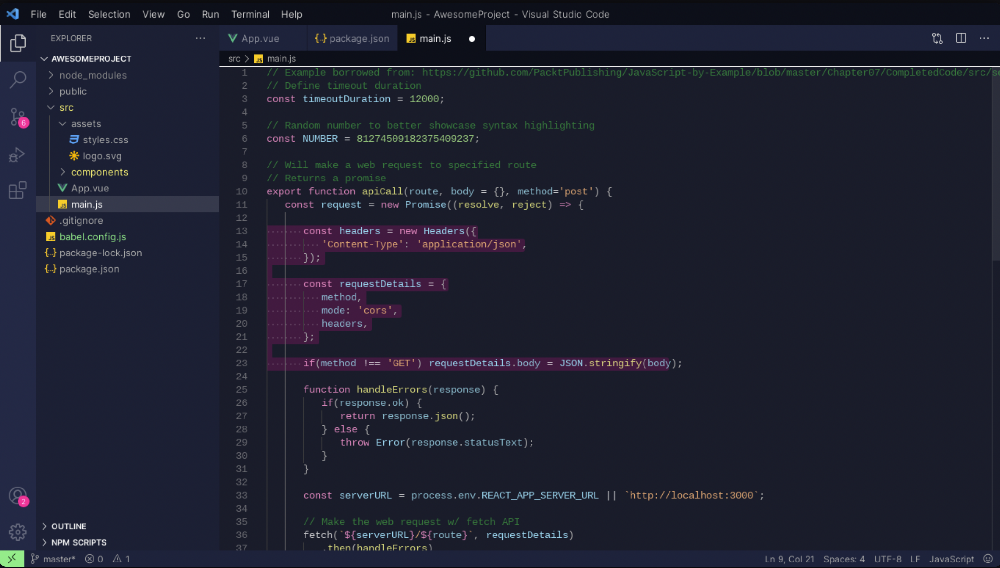
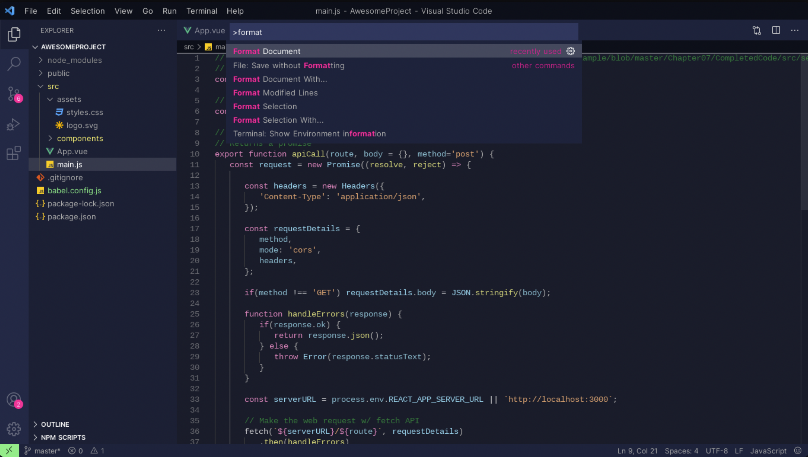
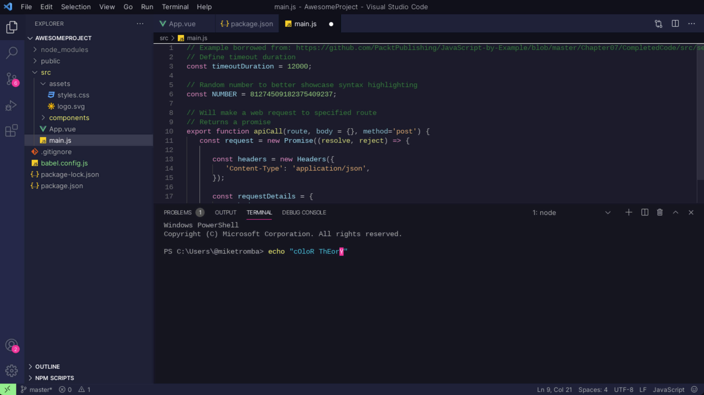

# Subtle Pink Accent Theme

> A theme for VS Code, subtle background with pink accent.

## Usage for AI‑powered code editors

**This incredibly beautiful theme may encounter an issue where it doesn’t get listed in the marketplaces of newly released AI‑powered code editors (Windsurf, Kiro, etc.), so please use the manual download guide we’ve added at the bottom and get back to life.** [🔽 Go Manual Installation](#manual-installation-with-vsix)

## Screenshots





## Installation with Marketplace

1. Install [Visual Studio Code](https://code.visualstudio.com/)
2. Launch Visual Studio Code
3. Open the **Extensions** view (⇧⌘X on Mac or Ctrl+Shift+X on Windows/Linux)
4. Search for `subtle-pink`
5. Click **Install**
6. Click **Reload** if prompted
7. Open **File** > **Preferences** > **Color Theme** (or ⇧⌘P / Ctrl+Shift+P, then type **Color Theme**)
8. Select **Subtle Pink**

## Manual Installation with VSIX

1. **Clone the repo and go to the dist directory**

   ```bash
   git clone https://github.com/BlanchDev/vscode-Theme-Subtle-Pink.git
   cd vscode-Theme-Subtle-Pink
   cd dist
   ```

2. **Install the VSIX package**

   - The file `subtle-pink-1.0.0.vsix` is already in the `dist/` folder, so you can skip building it.

   _Examples with Windsurf._

   For custom user profile.

   ```bash
   windsurf --profile "your_profile_name" --install-extension subtle-pink-1.0.0.vsix
   ```

   For default user profile.

   ```bash
   windsurf --install-extension subtle-pink-1.0.0.vsix
   ```

3. **Select the theme**

   ```bash
   Ctrl+Shift+P  # Then "Preferences: Color Theme"
   Subtle Pink
   ```

   or reload and select

   ```bash
   Ctrl+Shift+P  # Then "Developer: Reload Window"
   Ctrl+Shift+P  # Then "Preferences: Color Theme"
   ```

> Enjoy the soft subtle vibes! 🌸
